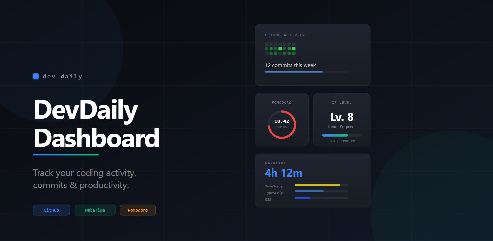

# DevDaily Dashboard

A modern developer productivity dashboard for tracking coding activity, GitHub contributions, WakaTime coding time, and daily workflow — all in one place.



**Live demo → [devdaily-dashboard.vercel.app](https://devdaily-dashboard.vercel.app/)**

---

## Features

| Widget | Description |
|---|---|
| **GitHub Activity** | Full-year contribution heatmap via GraphQL, recent commits, repo stats, coding streak, monthly goal tracker |
| **WakaTime** | Today's coding time and language breakdown via server-side proxy |
| **Pomodoro Timer** | 25/5 focus sessions with browser notifications and session counter |
| **Task Manager** | Prioritised tasks with due dates, filters, and localStorage persistence |
| **Dev Notes** | Markdown scratchpad with autosave |
| **LeetCode Progress** | Difficulty breakdown, monthly trend chart, recent submissions |
| **XP Level System** | Gamified developer leveling from real activity — commits, tasks, Pomodoros |
| **Productivity Score** | Weighted daily score across all tracked dimensions |
| **Dark / Light Mode** | Persistent theme toggle with full contrast support in both modes |

---

## Tech Stack

| Layer | Technology |
|---|---|
| Frontend | React 18, Vite |
| Styling | Tailwind CSS |
| Charts | Chart.js, react-chartjs-2 |
| GitHub data | REST API (profile, repos, commits) + GraphQL API (contribution calendar) |
| Coding time | WakaTime API via Vercel serverless proxy |
| Deployment | Vercel |

---

## Local Development

### Prerequisites
- Node.js 18+ — [nodejs.org](https://nodejs.org)
- VS Code — [code.visualstudio.com](https://code.visualstudio.com)
- Git — [git-scm.com](https://git-scm.com)

### Setup
```bash
# 1. Enter the project folder
cd dev-daily-dashboard

# 2. Install dependencies
npm install

# 3. Copy the environment file
cp .env.example .env

# 4. Start the dev server
npm run dev
```

Open **http://localhost:5173** in your browser.

---

## Environment Variables

Create a `.env` file in the project root.
```env
# GitHub Personal Access Token — optional but strongly recommended
# Raises rate limit from 60 → 5,000 req/hr
# Also unlocks the full-year GraphQL contribution heatmap
# Create at: https://github.com/settings/tokens/new
# Required scopes: read:user, public_repo
VITE_GITHUB_TOKEN=ghp_xxxxxxxxxxxxxxxxxxxx

# Pre-fill the GitHub username field on load (optional)
VITE_DEFAULT_GITHUB_USERNAME=

# WakaTime API Key — only needed for local development without the proxy
# On Vercel, use WAKATIME_API_KEY (server-side, no VITE_ prefix) instead
# Find at: https://wakatime.com/settings/api-key
VITE_WAKATIME_API_KEY=
```

### In-app credential entry

Tokens can also be entered directly in the dashboard UI — click the **WakaTime API Key** or **GitHub Token** buttons in the settings bar at the bottom of the page. Keys are stored in `localStorage` and are never sent to any server other than the relevant API.

---

## GitHub Data Architecture

The contribution heatmap uses two data sources depending on token availability:

| Mode | Source | Coverage | Accuracy |
|---|---|---|---|
| **GraphQL** (token required) | `contributionCalendar` | Full 365 days | Exact — same source as github.com |
| **REST fallback** (no token) | `/events/public` | ~90 days | Approximate — push events only |

REST endpoints are still used for profile data, repos, and recent commit messages regardless of mode.

---

## WakaTime Architecture
```
Widget → wakatimeApi.js → GET /api/wakatime → WakaTime API
```

The WakaTime API key stays server-side in the Vercel serverless function (`api/wakatime.js`). The browser never receives the key. If the proxy fails, the widget falls back to mock data automatically.

---

## XP System

XP is earned from real dashboard activity and persists across sessions via `localStorage`.

| Activity | XP |
|---|---|
| GitHub commit | +5 XP |
| Pomodoro session | +15 XP |
| Task completed | +5 XP |
```
level    = floor(totalXP / 100)
progress = totalXP % 100
```

Daily deduplication prevents XP from being awarded twice for the same activity on the same day. XP never resets on page reload.

---

## Productivity Score

A 0–100 weighted daily score calculated from five dimensions:

| Metric | Weight | Max for 100% |
|---|---|---|
| GitHub commits | 30% | 10 commits |
| Coding streak | 20% | 30 days |
| Tasks completed | 25% | 5 tasks |
| Pomodoro sessions | 15% | 4 sessions |
| LeetCode solved | 10% | 3 problems |

Weights and maxes are constants in `src/services/productivityService.js` — easy to tune.

---

<div align="center">
  Made with ❤️ and ☕ by Ralph Rosael · Built with React + Vite + GitHub API + WakaTime + Chart.js
</div>
